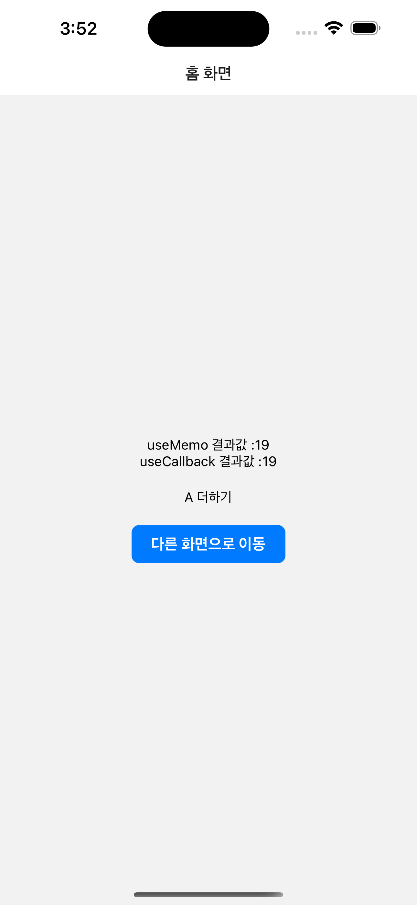
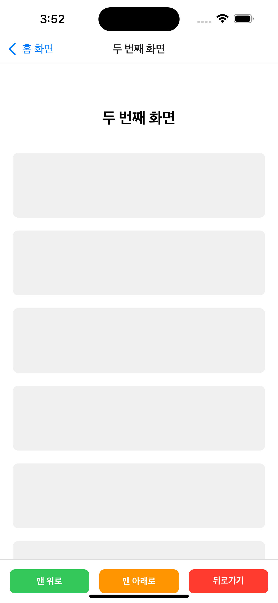

# React Hooks에 대하여

|  |  |
|:---:|:---:|
| Index Image | Second Image |

## 목차
1. [What is Hook?](#1-what-is-hook)
2. [실무에서 자주 사용하는 Library Hook](#2-실무에서-자주-사용하는-library-hook)
3. [커스텀 Hook 예제](#3-커스텀-hook-예제)
4. [최적화를 위한 Memoization](#4-최적화를-위한-memoization)

---

## 1. What is Hook?

### Hook이란?
Hook은 React에서 **state**와 기타 **side effect**들을 다루기 위해 탄생한 기능입니다.

### Hook을 만든 이유

#### (1) 컴포넌트 간 상태 관련 로직 재사용의 어려움
- 기존에는 컴포넌트 간 상태 관련 로직을 재사용하기 어려웠습니다
- Hook을 통해 로직을 재사용할 수 있게 되었습니다

#### (2) 컴포넌트가 커질수록 복잡해지는 로직
- 컴포넌트가 커질수록 복잡한 로직들이 얽혀있게 됩니다
- **단일 책임 원칙**에서도 벗어나는 문제가 발생했습니다

#### (3) 클래스 컴포넌트의 혼란
- **`this` 키워드**로 인한 좋지 못한 개발 경험
- 클래스 컴포넌트 사용 시 발생하는 다양한 혼란들

### Hook의 사용 규칙

#### 최상단에서 Hook 사용하기
- Hook은 **컴포넌트의 최상단**에서 사용해야 합니다
- React에서는 선언하는 Hook의 **순서**에 따라 접근할 수 있는 **인덱스 값**이 부여됩니다
- 조건부로 Hook을 호출하면 인덱스 값이 달라져 **의도치 않은 버그**가 발생할 수 있습니다


---

## 2. 실무에서 자주 사용하는 Library Hook

### useBackHandler
- **Android**에서 뒤로가기 버튼을 처리할 때 사용하는 Hook
- 사용자가 뒤로가기 버튼을 눌렀을 때의 동작을 커스터마이징할 수 있습니다

### useAppState
- **iOS와 Android** 모두에서 앱의 상태(활성/비활성/백그라운드)를 감지하는 Hook
- 앱이 포그라운드에서 백그라운드로 전환되거나 그 반대의 상황을 감지할 수 있습니다

### useRoute
- **Expo**에서 화면 이동 시 사용하는 Hook
- `useRouter.push(..)` 메서드를 통해 다른 화면으로 이동할 수 있습니다

### useIsFocused
- 현재 화면이 **포커스 상태**인지를 확인하는 Hook
- **반환값**을 제공하며, 다른 화면으로 이동하면 현재 화면의 포커스가 `false`가 됩니다

### useFocusEffect
- 해당 화면이 **포커스될 때 호출**되는 Hook
- 화면이 포커스될 때마다 특정 로직을 실행하고 싶을 때 사용합니다

### useRef
- **useRef**는 `ScrollView`, `TextInput` 등과 함께 사용됩니다
- **state가 아니기 때문에** React 철학에 따라 **리렌더링되지 않습니다**
- useScrollToTop과 함께 사용하여 스크롤 위치를 제어할 수 있습니다

### useMount
- 내부에서 **useEffect**를 사용하지만, **의도를 명확하게** 하기 위해 사용합니다
- useEffect는 **다용도**이기 때문에:
  - 코드 **가독성이 떨어질** 수 있습니다
  - useEffect를 **여러 개 사용하면** 코드 분석이 어려워집니다
- useMount를 사용하면 컴포넌트 **마운트 시점의 로직**임을 명확히 알 수 있습니다

---


## 3. 클래스형 컴포넌트 -> 함수형 컴포넌트로 전환

## 4. 최적화를 위한 Memoization
### useMemo

```tsx
interface HookTestComponentUseMemoProps {
  a: number;
  b: number;
}

const HookTestComponentUseMemo = ({ a, b }: HookTestComponentUseMemoProps) => {
  const text = useMemo(() => {
    return a + b;
  }, [a, b]);
  return <Text>useMemo 결과값 :{text}</Text>;
};

export default HookTestComponentUseMemo;
```
### useCallback
```tsx
interface HookTestComponentUseCallbackProps {
  a: number;
  b: number;
}

const HookTestComponentUseCallback = ({ a, b }: HookTestComponentUseCallbackProps) => {
  const doSome = useCallback(() => {
    return a + b;
  }, [a, b]);
  return <Text>useCallback 결과값 :{doSome()}</Text>;
};

export default HookTestComponentUseCallback;

```
### useBackHandler
- Android에서 뒤로가기 버튼을 처리할 때 사용하는 Hook
- 사용자가 뒤로가기 버튼을 눌렀을 때의 동작을 커스터마이징할 수 있습니다
```tsx
  useBackHandler(() => {
    console.log("backHandler");
    return true;
  });

```

### useAppState
- **iOS와 Android** 모두에서 앱의 상태(활성/비활성/백그라운드)를 감지하는 Hook
  - iOS: active, inactive, background
  - AND: active, background
- 앱이 포그라운드에서 백그라운드로 전환되거나 그 반대의 상황을 감지할 수 있습니다

```tsx
  const appState = useAppState();
  console.log("appState", appState);
```

```tsx
  useEffect(() => {
    AppState.addEventListener("change", (state) => {
      console.log("appState", state);
    });
  }, []);
```
### useRoute
```tsx
router.push('/second');
```

### useIsFocused
- 현재 화면이 **포커스 상태**인지를 확인하는 Hook
- **반환값**을 제공하며, 다른 화면으로 이동하면 현재 화면의 포커스가 `false`가 됩니다

```tsx
  const isFocused = useIsFocused()

  useEffect(() => {
    console.log("useEffect", isFocused);
    if(isFocused) {
        console.log("isFocused");
    }
  }, [isFocused]);

```

### useFocusEffect
- 해당 화면이 **포커스될 때 호출**되는 Hook
- 화면이 포커스될 때마다 특정 로직을 실행하고 싶을 때 사용합니다

```tsx
  useFocusEffect(() => {
    console.log("useFocusEffect");
  },);

```

### useRef
- **useRef**는 `ScrollView`, `TextInput` 등과 함께 사용됩니다
- **state가 아니기 때문에** React 철학에 따라 **리렌더링되지 않습니다**
- useScrollToTop과 함께 사용하여 스크롤 위치를 제어할 수 있습니다


```tsx
  const scrollViewRef = useRef<ScrollView>(null);
  
  const scrollToTop = () => {
    console.log("scrollToTop 버튼이 눌렸습니다!");
    scrollViewRef.current?.scrollTo({
      y: 0,
      animated: true,
    });
  };

  const scrollToBottom = () => {
    console.log("scrollToBottom 버튼이 눌렸습니다!");
    scrollViewRef.current?.scrollToEnd({
      animated: true,
    });
  };
  
  return (
    <View style={styles.container}>
      <ScrollView 
        ref={scrollViewRef}

```
### useMount
- 내부에서 **useEffect**를 사용하지만, **의도를 명확하게** 하기 위해 사용합니다
- useEffect는 **다용도**이기 때문에:
  - 코드 **가독성이 떨어질** 수 있습니다
  - useEffect를 **여러 개 사용하면** 코드 분석이 어려워집니다
- useMount를 사용하면 컴포넌트 **마운트 시점의 로직**임을 명확히 알 수 있습니다

```tsx
export const useMount = (callback: () => void) => {
  useEffect(() => {
    callback();
  }, []);
};
```

### useUnmount
```tsx
export const useUnmount = (callback: () => void) => {
  const callbackRef = useRef(callback);
  
  callbackRef.current = callback;

  useEffect(() => {
    return () => {
      callbackRef.current();
    };
  }, []);
};
```